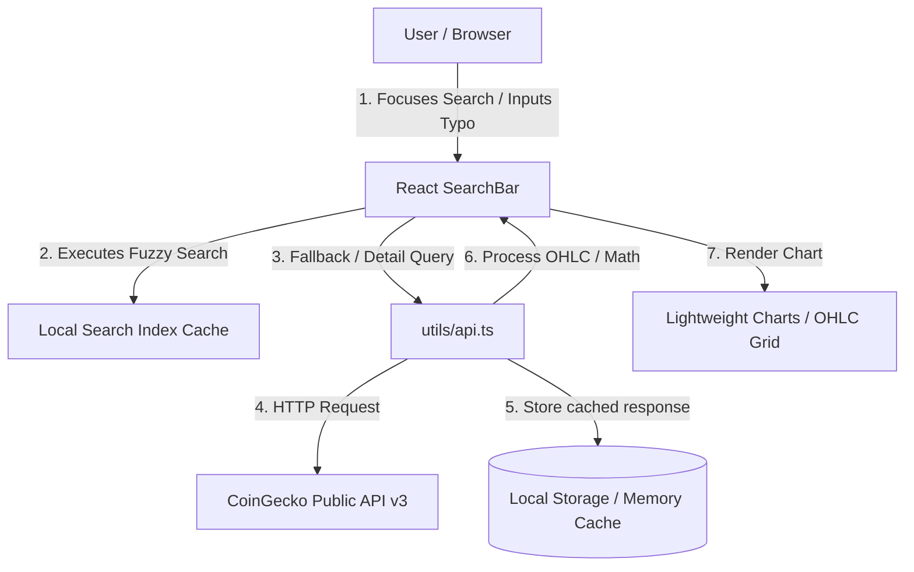

# prem-20260629

## Project Overview

This repository contains the Fullstack Engineering Assessment covering two primary tasks:

1. **Test No. 1: Cryptocurrency Price Chart (Crypto Explorer)**
    A responsive Client-side Single Page Application (SPA) designed to search and display live-updated cryptocurrency price charts and detailed OHLC (Open, High, Low, Close) statistics. Using client-side routing (React Router), the application features two main pages: a **Trends Dashboard** and a detailed **Coin Statistics & Charts Page**, alongside smart search suggestions and custom scrollable trending coins.
   
2. **Test No. 2: Stock Profit Calculator**
   A TypeScript utility that calculates the maximum possible profit from buying and selling a stock once, given an array of historical stock prices, running in optimal $O(n)$ time complexity and $O(1)$ space complexity. It includes unit tests built with Jest.

---

## Tech Stack

- **Frontend (Test No. 1):** React (v19), TypeScript, Ant Design (v6), Lightweight Charts (by TradingView), React Router (v7), TanStack React Query (v5).
- **Styling:** Vanilla CSS & Ant Design Tokens.
- **Backend/Serving:** Nginx (Alpine) for Docker production serving.
- **Testing (Test No. 2):** TypeScript, Jest, ts-jest.
- **Package Manager:** pnpm.

---

## 🎨 Design & Documentation

### 📄 Product Design Review (PDR)
The application was designed under several key architectural constraints:
- **Search Tolerance:** Implementing fuzzy/Levenshtein algorithms locally when API endpoints rate-limit or fail, ensuring users can search with typos (e.g. typing "etherium" to retrieve "ethereum").
- **Minimalist UX:** Restricting chart time-range options to prevent cognitive overload (e.g. choosing 1 Day, 7 Days, 30 Days, 90 Days).
- **API Performance:** Utilizing local caching (5-minute TTL for api requests, 24-hour TTL for full coins dictionary) to bypass CoinGecko's public demo API rate limits.

### 🎥 Demo Video
- [Walkthrough Video Link (Replace with your actual link)](#)

### 🎨 Figma Design Link
- [Figma Design File (Replace with your actual link)](#)

### 🏗️ System Architecture



### 💡 Technical Decisions
- **Ant Design & Custom SVG**: Chosen to speed up development of layout grids, cards, and theme toggles, combined with lightweight inline SVGs (like the brand logo) to ensure vector sharpness and instant rendering.
- **Lightweight Charts (TradingView)**: Used instead of generic chart libraries (like Chart.js) because it specializes in financial candle charts, rendering millions of ticks smoothly via Canvas.
- **Multi-stage Docker Build**: Splits build dependencies from production runtime to output a secure, optimized container image (~25MB) running Nginx.

---

## 🚀 Getting Started / How to Run

### Environment Variables & API Key Handling

The application communicates with the CoinGecko API and relies on the following environment variables (defined in your local `.env` file):
- `VITE_COINGECKO_API_KEY`: Your CoinGecko API key.
- `VITE_USE_API_KEY`: Set to `true` to authenticate API calls with the key, or `false` to use the public demo endpoint.

> [!NOTE]
> **API Key Convenience for Reviewers**
> For testing and evaluation convenience, a working API key has been pre-configured directly inside the Docker build configuration. This ensures that reviewers can simply run `docker build` and launch the application without the extra setup step of obtaining or configuring custom API keys. Since this repository is strictly for this submission, we've pre-packaged it to make the verification process as seamless as possible.

#### Using Your Own API Key with Docker
If you want to build the Docker image using your own API key instead of the default fallback keys, pass them as `--build-arg` options during the build process:
```bash
docker build -t test-no1-app \
  --build-arg VITE_COINGECKO_API_KEY="YOUR_ACTUAL_API_KEY" \
  --build-arg VITE_USE_API_KEY="true" \
  ./testNo1-App
```

---

### Docker Setup (Primary Method)

The project includes a multi-stage Docker build to build and serve the application locally under Nginx.

1. **Build the image** (automatically embeds the default demo API key):
   ```bash
   docker build -t test-no1-app ./testNo1-App
   ```

2. **Run the container**:
   ```bash
   docker run -d -p 8080:80 --name crypto-app test-no1-app
   ```

3. **Access the application**:
   Open your browser and navigate to **[http://localhost:8080](http://localhost:8080)**.

---

### Local Installation

Make sure you have [Node.js (v20+)](https://nodejs.org/) and [pnpm](https://pnpm.io/) installed.

#### Running Test No. 1 (Cryptocurrency Price Chart)

1. Navigate to the app directory:
   ```bash
   cd testNo1-App
   ```
2. Install dependencies:
   ```bash
   pnpm install
   ```
3. Run the development server:
   ```bash
   pnpm run dev
   ```
4. Access the local app at `http://localhost:5173`.

#### Running Test No. 2 (Stock Profit Calculator & Tests)

1. Navigate to the test directory:
   ```bash
   cd testNo2-App
   ```
2. Install dependencies:
   ```bash
   pnpm install
   ```
3. Run the Jest unit tests:
   ```bash
   pnpm test
   ```
4. Or run the calculator script directly using:
   ```bash
   npx ts-node maxProfit.ts
   ```

---

## 📊 Test No. 1: Cryptocurrency Price Chart

### Implementation Highlights

- **Smart Search & Suggestions (6a, 6b):**
  - **Target**: Users must be able to search for coins without needing to supply exact name queries (Fuzzy Search - 6a), and when the search input receives focus, it must display initial suggestions (Suggestions on Focus - 6b) in a clean, interactive dropdown.
  - **Solution**:
    - *Suggestions on Focus*: When a user clicks or focuses on the empty search box, it immediately presents a list of top-ranked coins (e.g. Bitcoin, Ethereum) with their thumbnail logos and market ranks, guiding the user before they even start typing.
    - *Typo Tolerance during Typing*: As the user types, it performs instantaneous filtering. If they enter a specific coin ticker abbreviation (e.g., `"eth"` or `"btc"`), the search engine immediately matches the exact ticker symbol and elevates it to the highest priority. The search engine also supports **partial search** (e.g., typing a partial name like `"ether"` matches and suggests `"Ethereum"`). If they misspell or make typos (e.g. `"etherium"`), the spelling tolerance engine calculates similarity and recommends the correct coin. Crucially, if a typo matches multiple coins (e.g., `"btcoin"` matches `"Bitcoin"` but could also match obscure low-volume tokens), the engine **prioritizes top 250 assets by market cap**, sorting the mainstream assets to the very top of the list since they represent the user's most likely intent.
    - *Auto-Select Top Match on Enter*: To prevent empty states or navigation failures when a user types a misspelled term and immediately presses **Enter** (e.g., typing `"btcoin"` and hitting Enter), the input automatically intercepts the keystroke and navigates to the first (highest relevance) option in the suggestion list, which would be `"Bitcoin"`. This also overrides a common design bug where pressing Enter selects whatever option the mouse cursor happens to be hovering over in the background; our implementation always forces navigation to the system's top recommendation instead of the hovered item.
  - **Implementation**:
    - *Local Data Indexing*: To avoid making network requests on every keystroke (which would quickly exhaust the CoinGecko API rate limit), we retrieve the complete list of 10,000+ supported coins via the `/coins/list` endpoint and the top 250 assets via the `/coins/markets` endpoint on initial page load, caching them in `localStorage` with a 24-hour TTL.
    - *Focus Dropdown*: Constructed in [SearchBar.tsx](file:///d:/prem-20260629/testNo1-App/src/components/SearchBar.tsx) using Ant Design's `AutoComplete` component, fetching and rendering the top 15 coins by market cap passed from [App.tsx](file:///d:/prem-20260629/testNo1-App/src/App.tsx) on input focus.
    - *Fuzzy Match Logic (Local Cache)*: Sourced entirely from the locally cached `/coins/list` (id, name, symbol mapping) and `/coins/markets` (rank and logo thumbnails) data inside `localStorage`. Implemented in `localFuzzySearch` within [api.ts](file:///d:/prem-20260629/testNo1-App/src/utils/api.ts) using a scoring hierarchy:
      1. **Tier 1 (Exact Match - Score 0)**: Matches symbol or name exactly (e.g. searching `"eth"` matches symbol `"eth"`, returning `"Ethereum"` first).
      2. **Tier 2 (Prefix / Partial Match - Score 1)**: Matches coins starting with the query string (e.g. typing `"sol"` matches `"Solana"`, and typing `"ether"` matches `"Ethereum"`).
      3. **Tier 3 (Fuzzy Match - Score 2+)**: Runs a **Levenshtein Distance** edit-distance check on `name` and `symbol` for queries with spelling mistakes (e.g. mapping `"etherium"` to `"Ethereum"`).
      4. **Market Cap Tie-Breaker Sorting**: Results are sorted first by their match score (relevance). For ties (e.g. multiple spelling matches with the same edit distance, such as `"Bitcoin"` and a low-volume token), the engine checks the cached top 250 popular coins and sorts them by **market capitalization rank**. This pushes the mainstream, high-volume asset (like `"Bitcoin"` #1) to the top of the list (index `0`), capping the suggestions to the top 10 matches.
    - *Enter Key Interceptor & Hover Override*: Handled in [SearchBar.tsx](file:///d:/prem-20260629/testNo1-App/src/components/SearchBar.tsx) via the `<Input>` tag's `onKeyDown` listener. If `e.key === "Enter"` and there is at least one active match in the filtered options list, the keypress is intercepted via `e.preventDefault()`, and the app immediately navigates to `options[0].value` (the best matched asset id). By listening directly to the native input's `onKeyDown` event, we bypass Ant Design AutoComplete's default behavior which yields selection focus to whichever option is currently under the mouse hover state.
    - *Selection & Navigation (Redirect & Live Queries)*: When a user selects a coin from the suggestions or presses Enter, the app redirects to the detailed route `/coin/:id`. This view fires two concurrent live API requests to display details:
      1. `/coins/{id}`: Fetches real-time price, title description, and OHLC market metrics (Open, High, Low, Close, Volume, Market Cap).
      2. `/coins/{id}/ohlc`: Fetches historical candlestick price data to render the TradingView-style interactive chart for the selected range (1D, 7D, 1M, 3M, 6M, 1Y).
- **Interactive Chart & Market Statistics (6c, 6d, 6e):**
  - **Target**: Users can see their given coin price chart in a specific time range, with a default range set at first (6c). They can choose other ranges to view different intervals, but the application should not allow options too much to maintain a clean UI (6d). Users can also see their given coin price statistics in detail, including open, high, low, and close (ohlc) data (6e).
  - **Solution**:
    - *Candlestick Choice for OHLC*: We chose a **Candlestick Chart** representation over a simple line chart specifically because candlesticks natively pack and convey all four key OHLC components (Open, High, Low, Close) within each time tick, allowing traders to quickly spot price spreads and trends.
    - *TradingView Lightweight Charts Integration*: We integrated **TradingView's Lightweight Charts** (`lightweight-charts`) library to render the interactive candlestick chart. We chose this library due to the following core advantages:
      1. **Professional Financial UX**: Developed by TradingView (the global standard for financial charting), it provides the exact high-fidelity interaction model that traders expect, including smooth pixel-perfect crosshair tracking, auto-scaling axes, and intuitive drag/zoom capabilities.
      2. **Exceptional Performance & Footprint**: Unlike heavy SVG-based libraries, Lightweight Charts utilizes an optimized HTML5 Canvas backend that renders hundreds of candles with zero rendering lag, all packaged in a minimal, lightweight footprint (~40KB gzipped) that fits mobile device constraints.
      3. **Native React-Responsive Design**: The canvas fits dynamically inside our CSS Grid layout via a native `ResizeObserver` listener, adapting layout constraints instantly upon window resize.
    - *Default Range Selection Research*: According to industry-standard financial chart designs (e.g., TradingView, MetaTrader, and broker UIs), the optimal number of candles to render on a single screen viewport is **80 to 150 candles** (with **120 candles** serving as the ideal sweet spot / gold standard). Rendering fewer than 80 candles makes individual bars look excessively wide/fat and lacks sufficient historical context to draw technical indicators (like moving averages). Conversely, rendering more than 150 candles squishes each candle to a width of 1–2 pixels, making it impossible for the human eye to differentiate between the **candle body** and the **candle wicks (shadows)**.
    - *Rationale for Limiting Range Filters (1D, 7D, 1M, 3M, 6M, 1Y)*: In accordance with requirement **6d** (*"not allow options too much"*), we consciously limited our time selectors to exactly six core intervals: **1 Day (1D)**, **7 Days (7D)**, **1 Month (1M/default)**, **3 Months (3M)**, **6 Months (6M)**, and **1 Year (1Y)**. This selection is grounded in two primary design and financial standards:
      1. **Dow Theory of Market Trends**: In classical technical analysis, Dow Theory categorizes market price movements into three trends: Primary Trends (long-term macro movements, represented by 6M and 1Y), Secondary Trends (medium-term corrective waves, represented by 1M and 3M), and Minor Trends (short-term day-to-day noise, represented by 1D and 7D). This exact 6-filter configuration is the industry standard adopted by major charting providers like TradingView, Bloomberg Terminal, and Yahoo Finance.
      2. **Hick's Law (HCI/UX Design Principle)**: Hick's Law mathematically proves that the time required to make a decision increases logarithmically with the number and complexity of choices. Restricting the selectors to these 6 high-utility, standard intervals avoids visual clutter on mobile viewports and optimizes user interaction speed.
    - *Candlestick Grouping & Remainder Handling*: When chunking raw data points, our algorithm dynamically clusters ticks so that the final rendered candlestick count lands as close as possible to the ideal **120-candle sweet spot** (for clean visual density). Any leftover fractional elements are merged into the final chunk to protect real-time data integrity.
    - *Layout Priority*: Sourced side-by-side at the very top of the statistics card are **Market Cap** (left-aligned) and **Volume (24h)** (right-aligned) to give a clear snapshot of market liquidity immediately.
    - *Interactive OHLC Ticks*: Underneath the aggregates, a clean vertical table lists the **Open**, **High**, **Low**, and **Close** stats for the selected time range. The chart canvas is fully interactive: hovering the crosshair over any point on the chart canvas dynamically updates these baseline OHLC fields in real-time to correspond to that specific coordinate's candle values.
  - **Implementation**:
    - *Chunk Size & Granularity Calculation*: To maintain a clean visual density, the algorithm aims to output a candle count as close to our configured **120-candle sweet spot** (represented in code by `targetCandles = 120`) as mathematically possible. It does this by dynamically calculating the grouping factor using the formula `chunkSize = Math.max(1, Math.round(ohlcData.length / 120))`. The following table shows the data breakdown for each interval:
      
      | Interval (Range) | API Granularity | Raw Data Points | Chunk Size (`Math.max(1, round(N/120))`) | Rendered Candles |
      | :--- | :--- | :--- | :--- | :--- |
      | **1 Day** | 30 minutes | 48 points | `Math.max(1, round(48/120)) = 1` | **48 candles** |
      | **7 Days** | 4 hours | 42 points | `Math.max(1, round(42/120)) = 1` | **42 candles** |
      | **30 Days (Default)** | 4 hours | 180 points | `Math.max(1, round(180/120)) = 2` | **90 candles** *(Optimal)* |
      | **90 Days** | 4 days | 22 points | `Math.max(1, round(22/120)) = 1` | **22 candles** |
      | **6 Months** | 4 days | 45 points | `Math.max(1, round(45/120)) = 1` | **45 candles** |
      | **1 Year** | 4 days | 91 points | `Math.max(1, round(91/120)) = 1` | **91 candles** |

      > [!NOTE]
      > Due to hard constraints on CoinGecko's REST API granularity (for instance, the API only returns a maximum of 48 points for 1D, 42 points for 7D, 22 points for 90D, and 45 points for 6M), it is mathematically impossible to scale the rendered output into the ideal 80–150 candle range for these specific intervals. However, our formula dynamically ensures that for any interval that does provide sufficient density (such as 30D and 1Y), the final count matches the sweet spot as closely as possible without introducing artificial or simulated data.

    - *Default Range Selection (6c)*: On loading any coin detail page, the React state `selectedRange` in [CryptoDetailPage.tsx](file:///d:/prem-20260629/testNo1-App/src/components/CryptoDetailPage.tsx) defaults to **30 Days (1M)**. Even though **1 Year (1Y)** mathematically yields 91 rendered candles (which is slightly closer to our 120-candle sweet spot than 30 Days' 90 candles), we consciously chose 30 Days as our default due to the following critical industry standards and user experience reasons:
      1. **Recent Price Action Resolution (Data Freshness)**: Cryptocurrencies are highly volatile assets where traders prioritize reading recent intraday price movements, support/resistance levels, and current trends. The 30 Days range queries data at a detailed **4-hour granularity**, whereas the 1 Year range averages data into coarse **4-day blocks** (which flattens out and completely hides crucial daily breakouts or recent news-driven price spikes).
      2. **Industry Standard Mapping**: Leading market intelligence dashboards (like CoinMarketCap and CoinGecko) and major exchange terminals (like Binance) default coin details to short/medium-term views (24 hours or 30 days) to keep immediate market context visible, reserving macro-yearly trends for optional manual selection.
      3. **Page Load Performance**: Fetching and processing a 30-day historical window transfers a significantly smaller API data payload than pulling 365 days of history, ensuring a faster initial page load and rendering speed.
    - *Dynamic Granularity*: The `/coins/{id}/ohlc` API endpoint accepts a `days` query parameter (e.g. `1`, `7`, `30`, `90`, `180`, `365`). When the user clicks a segment in the range selector, it updates the `selectedRange` state, triggering a React Query refetch of the price chart data.
    - *Candle Formatting & Remainder-Merging Loop*: In `PriceChart.tsx`, we parse the returned timestamp-price array. For the **1 Day** range, it maps high-frequency ticks. For larger ranges, it maps daily candles to maintain rendering performance. In [CryptoDetailPage.tsx](file:///d:/prem-20260629/testNo1-App/src/components/CryptoDetailPage.tsx), to prevent losing the latest price points due to division remainders when grouping datasets, the loop detects the final iteration (`i + chunkSize * 2 > ohlcData.length`) and dynamically expands the final slice end to `ohlcData.length` to merge remainder ticks directly into the last candle.
    - *Live OHLC Aggregator*: The details page calls the `/coins/{id}` endpoint to fetch static metadata. In parallel, the `/coins/{id}/ohlc` response is processed to dynamically compute the **Open** (the first price in the array), **High** (maximum price in the range), **Low** (minimum price in the range), and **Close** (latest/current price in the array).
    - *Crosshair Interaction (Direct DOM Sync)*: The `CandlestickChart` component implements a crosshair tooltip listener (`chart.subscribeCrosshairMove`). When a user hovers over the chart canvas, the listener extracts the specific coordinate's candle values (Open, High, Low, Close) and directly updates the text content of the DOM elements using React `Refs` (e.g. `openStatRef`, `highStatRef`, etc.). By updating the DOM directly on every mouse movement, we bypass React state updates, avoiding expensive parent component re-renders and guaranteeing a fluid, zero-latency 60fps hover interaction. When the mouse leaves the canvas, it automatically resets the card values to show the overall range summary stats.

### Limitations & Considerations
- **API Rate Limits:** CoinGecko's keyless public API limits clients to ~10-30 requests/minute. The app implements background caching of the coin directory and uses React Query stale times to prevent double-fetching, falling back gracefully to cached mock data if rate limits are hit.
- **OHLC Resolution:** CoinGecko clusters candles automatically (e.g. 1-day range returns 30-minute granularity; 90-day range returns daily granularity). The chart handles this change in time resolution dynamically.

---

## Test No. 2: Max Profit Algorithm

### Project Overview
A highly optimized TypeScript algorithm and Jest testing suite designed to calculate the maximum potential profit from a chronological sequence of asset/stock prices. The implementation guarantees a single-pass traversal that solves the problem in linear time with constant memory.

### Technical Design & Solutions
- **Single-Pass Greedy Traversal ($\mathcal{O}(n)$ Time / $\mathcal{O}(1)$ Space)**: Rather than nested loops ($\mathcal{O}(n^2)$), the algorithm maintains a running tracking of the `minPrice` encountered so far. At each step, it calculates the profit if sold at the `currentPrice` and updates `maxProfit` if the new profit is higher, achieving maximum speed and zero memory overhead.
- **Floating-Point Precision Guard**: To handle assets with sub-dollar micro-fluctuations (common in volatile cryptocurrency markets, e.g. fractions like `$0.0001`), the profit is rounded using `Math.round(diff * 1e10) / 1e10` to bypass standard floating-point representation bugs (IEEE 754 precision issues).
- **Graceful Boundary Handlers**: Returns `0` instantly if the input array is null, empty, or contains only a single day's price (since buying and selling requires at least two distinct days).

### Project Structure
- [maxProfit.ts](file:///d:/prem-20260629/testNo2-App/maxProfit.ts): Contains the core algorithm function `findMaxProfit` and a runnable CLI demo.
- [maxProfit.test.ts](file:///d:/prem-20260629/testNo2-App/maxProfit.test.ts): Comprehensive unit test suite covering baseline happy paths, volatile markets, sub-dollar fractions, stagnant markets, decreasing trends, empty/single-day boundaries, and performance stress-testing.

### How to Run Locally

1. **Navigate to the Project Directory**:
   ```bash
   cd testNo2-App
   ```

2. **Install Dependencies**:
   ```bash
   pnpm install
   ```
   *(Or use `npm install` / `yarn install` if preferred)*

3. **Run Unit Tests (Jest)**:
   ```bash
   pnpm test
   ```

4. **Execute CLI Script Demo**:
   ```bash
   npx ts-node maxProfit.ts
   ```

