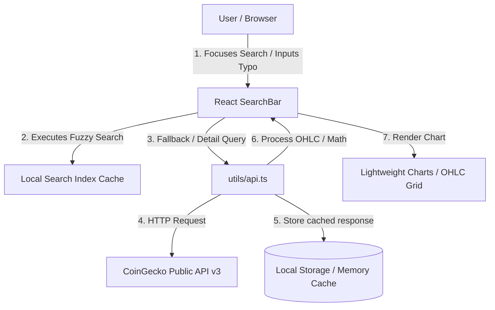

# prem-20260629

## Project Overview

This repository contains the Fullstack Engineering Assessment covering two primary tasks:

1. **Test No. 1: Cryptocurrency Price Chart (Crypto Explorer)**
   A user-friendly, responsive Single Page Application (SPA) designed to search and display live-updated cryptocurrency price charts and detailed OHLC (Open, High, Low, Close) statistics. It features smart search suggestions, custom scrollable trending coins, and pre-configured time ranges, running in a clean containerized environment.
   
2. **Test No. 2: Stock Profit Calculator**
   A TypeScript utility that calculates the maximum possible profit from buying and selling a stock once, given an array of historical stock prices, running in optimal $O(n)$ time complexity and $O(1)$ space complexity. It includes unit tests built with Jest.

---

## Tech Stack

- **Frontend (Test No. 1):** React (v19), TypeScript, Ant Design (v6), Lightweight Charts (by TradingView), React Router (v7), TanStack React Query (v5).
- **Styling:** Vanilla CSS & Ant Design Tokens.
- **Backend/Serving:** Nginx (Alpine) for Docker production serving.
- **Testing (Test No. 2):** TypeScript, Jest, ts-jest.
- **Package Manager:** pnpm.

---

## 🎨 Design & Documentation

### 📄 Product Design Review (PDR)
The application was designed under several key architectural constraints:
- **Search Tolerance:** Implementing fuzzy/Levenshtein algorithms locally when API endpoints rate-limit or fail, ensuring users can search with typos (e.g. typing "etherium" to retrieve "ethereum").
- **Minimalist UX:** Restricting chart time-range options to prevent cognitive overload (e.g. choosing 1 Day, 7 Days, 30 Days, 90 Days).
- **API Performance:** Utilizing local caching (5-minute TTL for api requests, 24-hour TTL for full coins dictionary) to bypass CoinGecko's public demo API rate limits.

### 🎥 Demo Video
- [Walkthrough Video Link (Replace with your actual link)](#)

### 🎨 Figma Design Link
- [Figma Design File (Replace with your actual link)](#)

### 🏗️ System Architecture



### 💡 Technical Decisions
- **Ant Design & Custom SVG**: Chosen to speed up development of layout grids, cards, and theme toggles, combined with lightweight inline SVGs (like the brand logo) to ensure vector sharpness and instant rendering.
- **Lightweight Charts (TradingView)**: Used instead of generic chart libraries (like Chart.js) because it specializes in financial candle charts, rendering millions of ticks smoothly via Canvas.
- **Multi-stage Docker Build**: Splits build dependencies from production runtime to output a secure, optimized container image (~25MB) running Nginx.

---

## 🚀 Getting Started / How to Run

### Docker Setup (Primary Method)

The project includes a multi-stage Docker build to build and serve the application locally under Nginx.

1. **Build the image** (automatically embeds the default demo API key):
   ```bash
   docker build -t test-no1-app ./testNo1-App
   ```

2. **Run the container**:
   ```bash
   docker run -d -p 8080:80 --name crypto-app test-no1-app
   ```

3. **Access the application**:
   Open your browser and navigate to **[http://localhost:8080](http://localhost:8080)**.

---

### Local Installation

Make sure you have [Node.js (v20+)](https://nodejs.org/) and [pnpm](https://pnpm.io/) installed.

#### Running Test No. 1 (Cryptocurrency Price Chart)

1. Navigate to the app directory:
   ```bash
   cd testNo1-App
   ```
2. Install dependencies:
   ```bash
   pnpm install
   ```
3. Run the development server:
   ```bash
   pnpm run dev
   ```
4. Access the local app at `http://localhost:5173`.

#### Running Test No. 2 (Stock Profit Calculator & Tests)

1. Navigate to the test directory:
   ```bash
   cd testNo2-App
   ```
2. Install dependencies:
   ```bash
   pnpm install
   ```
3. Run the Jest unit tests:
   ```bash
   pnpm test
   ```
4. Or run the calculator script directly using:
   ```bash
   npx ts-node maxProfit.ts
   ```

---

## 📊 Test No. 1: Cryptocurrency Price Chart

### Implementation Highlights

- **Smart Search & Suggestions (6a, 6b):**
  - **Fuzzy Search (6a):** Allows users to search without entering the exact name (e.g. typing "etherium" matches "ethereum") using a local Levenshtein spelling distance algorithm.
  - **Suggestions on Focus (6b):** As originally requested in the assessment guidelines, the search box displays quick suggestions when focused. This behavior was customized per the latest product requirements to suggest the top 15 coins sorted by **Market Cap** (e.g. Bitcoin, Ethereum, Solana) instead of trending coins.
- **Time Range Control (6c, 6d):**
  - Defaults charts to **30 Days** on initial load.
  - Offers a clean set of essential ranges: **1 Day**, **7 Days**, **30 Days**, **90 Days** (combining candles to prevent screen clutter).
- **Market Data Statistics (6e):**
  - Displays OHLC (Open, High, Low, Close) values.
  - Summarizes Market Cap and 24h Volume on the top card horizontally, followed by color-coded baseline stats.

### Limitations & Considerations
- **API Rate Limits:** CoinGecko's keyless public API limits clients to ~10-30 requests/minute. The app implements background caching of the coin directory and uses React Query stale times to prevent double-fetching, falling back gracefully to cached mock data if rate limits are hit.
- **OHLC Resolution:** CoinGecko clusters candles automatically (e.g. 1-day range returns 30-minute granularity; 90-day range returns daily granularity). The chart handles this change in time resolution dynamically.
