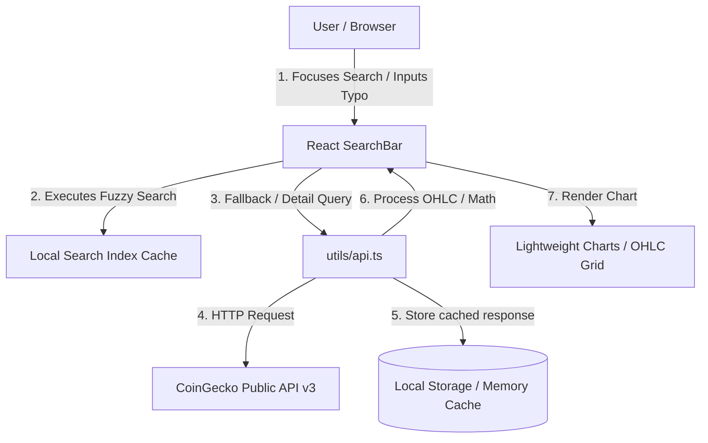

# Fullstack Engineering Assessment

**[🏠 Quick Start](README.md) | [📈 Test No. 1: Crypto Chart](./docs/test1-crypto-chart.md) | [🧮 Test No. 2: Max Profit](./docs/test2-max-profit.md)**

---

## Project Overview

This repository contains the Fullstack Engineering Assessment covering two primary tasks:

1. **[Test No. 1: Cryptocurrency Price Chart (Crypto Explorer)](./docs/test1-crypto-chart.md)**
   A responsive React Client-Side Single Page Application (SPA) designed to search and display live-updated cryptocurrency price charts and detailed OHLC statistics. Built with client-side routing, caching layers, typo-tolerant search suggestions, and interactive TradingView charts.
   
2. **[Test No. 2: Stock Profit Calculator (Max Profit Algorithm)](./docs/test2-max-profit.md)**
   A highly optimized TypeScript algorithm and Jest testing suite designed to calculate the maximum potential profit from stock prices, running in linear $\mathcal{O}(n)$ time complexity and constant $\mathcal{O}(1)$ space complexity.

---

## Tech Stack Summary

- **Frontend (Test 1):** React (v19), TypeScript, Ant Design (v6), Lightweight Charts (by TradingView), React Router (v7), TanStack React Query (v5).
- **Backend Serving:** Nginx (Alpine) inside Docker.
- **Algorithm & Testing (Test 2):** TypeScript, Jest, ts-jest.
- **Package Manager:** pnpm.

---

## 🎨 System Design & Architecture (Test 1)

For deep design reviews, Hick's Law/Dow Theory UX choices, and API constraint management, see the **[Test No. 1 Detailed Specs Document](./docs/test1-crypto-chart.md)**.



---

## 🚀 Getting Started / How to Run

### 1. Environment Variables (Test 1)
The application communicates with the CoinGecko API and relies on the following environment variables (defined in `testNo1-App/.env`):
- `VITE_COINGECKO_API_KEY`: Your CoinGecko API key.
- `VITE_USE_API_KEY`: Set to `true` to authenticate API calls with the key, or `false` to use the public demo endpoint.

> [!NOTE]
> **API Key Convenience for Reviewers**
> For testing and evaluation convenience, a working API key has been pre-configured directly inside the Docker build configuration. This ensures that reviewers can simply run `docker build` and launch the application without the extra setup step of obtaining or configuring custom API keys.

---

### 2. Docker Setup (Primary Method - Test 1)

The project includes a multi-stage Docker build to build and serve the application locally under Nginx.

1. **Build the image** (automatically embeds the default demo API key):
   ```bash
   docker build -t test-no1-app ./testNo1-App
   ```

2. **Run the container**:
   ```bash
   docker run -d -p 8080:80 --name crypto-app test-no1-app
   ```

3. **Access the application**:
   Open your browser and navigate to **[http://localhost:8080](http://localhost:8080)**.

---

### 3. Local Installation & Manual Run

Make sure you have [Node.js (v20+)](https://nodejs.org/) and [pnpm](https://pnpm.io/) installed.

#### Running Test No. 1 (Cryptocurrency Price Chart)

1. Navigate to the app directory:
   ```bash
   cd testNo1-App
   ```
2. Install dependencies:
   ```bash
   pnpm install
   ```
3. Run the development server:
   ```bash
   pnpm run dev
   ```
4. Access the local app at `http://localhost:5173`.

#### Running Test No. 2 (Stock Profit Calculator & Tests)

1. Navigate to the test directory:
   ```bash
   cd testNo2-App
   ```
2. Install dependencies:
   ```bash
   pnpm install
   ```
3. Run the Jest unit tests:
   ```bash
   pnpm test
   ```
4. Or run the calculator script directly using:
   ```bash
   npx ts-node maxProfit.ts
   ```

---

## 📁 Repository Directory Index
- [README.md](README.md) - Main Index and Quick Start Guide.
- [docs/test1-crypto-chart.md](./docs/test1-crypto-chart.md) - Detailed product decisions, TradingView Lightweight Charts details, table calculations, and performance metrics for Test 1.
- [docs/test2-max-profit.md](./docs/test2-max-profit.md) - Algorithm implementation details, Levenshtein details, and the 12-case Test Plan Table for Test 2.
- [testNo1-App/](./testNo1-App) - Crypto Explorer web application project directory.
- [testNo2-App/](./testNo2-App) - Max Profit Algorithm TypeScript project directory.
